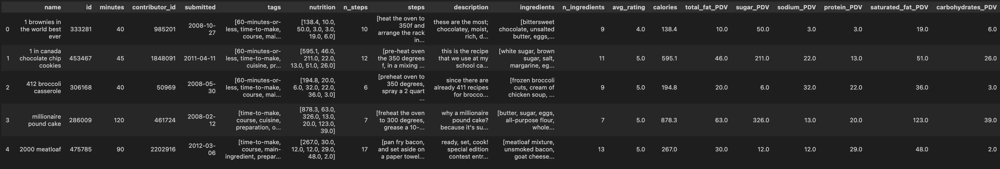

# Culinary Computing
## Recipe Analysis and Prediction through Data Science and Machine Learning
## Names: Amber Tang and Maggie Zhang

### Introduction
The dataset we chose to analyze was the "Recipes and Ratings" dataset, which included data on various recipes and their ratings from food.com. The data comes from two csv files, one which includes recipes data and the other of which includes the reviews and ratings submitted for each recipe. We wanted to use these datasets to answer the question "Is there a significant relationship between recipe complexity and recipe rating?". We defined complexity as a combination of the variables: (standardized) minutes, number of ingredients and number of steps. To access this data, we first left merged the two datasets on recipe, then calculated the average rating per recipe and added it to the original "recipes" dataframe. Our final dataframe had 83782 rows (meaning 83782 recipes). The columns that we analyzed were "minutes" (Minutes to prepare recipe), "n_steps" (Number of steps in recipe) and "ingredients" (List of ingredients in recipe).

### Data Cleaning and Exploratory Data Analysis
The first step we took to clean our data was filling ratings of 0 with np.nan. This is because these 0 ratings are from reviews where the reviewer failed to add a rating. The minimum possible star rating to give a recipe on food.com is a 1 star, and it only displays as 0 stars when a rating is missing. We added the np.nan values instead so the average rating is not incorrectly lowered.

The next step we took to clean our data was to split up the nutrition column into multiple columns for each variable contained in it. Each entry in this column was a string in the format:[calories (#), total fat (PDV), sugar (PDV), sodium (PDV), protein (PDV), saturated fat (PDV), carbohydrates (PDV)]. We implemented a function that parsed through each string, separated it into the different variables present and then added the separate values in at individual columns. We ended up adding these following columns: calories, total_fat_PDV, sugar_PDV, sodium_PDV,protein_PDV,saturated_fat_PDV and carbohydrates_PDV.

Additionally, we noticed that there were other columns with a similar list format. The tags, steps and ingredients columns were strings that looked like lists. We implemented a parse_list_str function that took a string and returned it in a list. We applied this function to the tags, steps and ingredients columns and replaced the strings in these columns with their list equivalents. Our final cleaned dataframe head is displayed below:

### Assessment of Missingness

### Hypothesis Testing

### Framing a Prediction Problem

### Baseline Model

### Final Model

### Fairness Analysis
